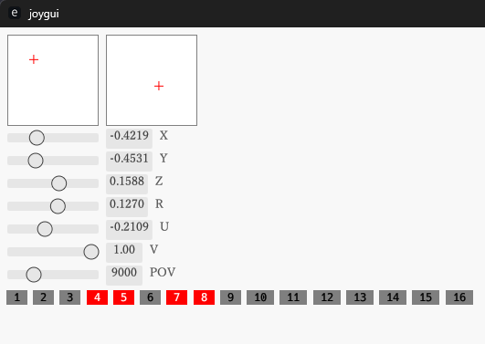

# joygui
Sample code to get joystick (gamepad) information on Windows using windows-rs ( joyget.rs ) and a sample to display with egui ( main.rs ).

Windowsでジョイスティック(ゲームパッド)の情報をwindows-rsを使って取得するサンプルコード( joyget.rs )と、eguiで表示するサンプル(main.rs)。



## How to use / 使い方

```rs
mod joyget;

const PAD_ID:u32 = 0;
let gamepad = joyget::update(PAD_ID);
println!("{:?}",gamepad);
```

## Licence
Public domain (The Unlicense)